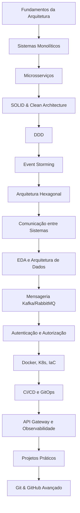
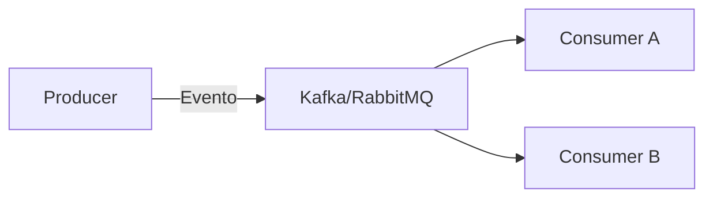
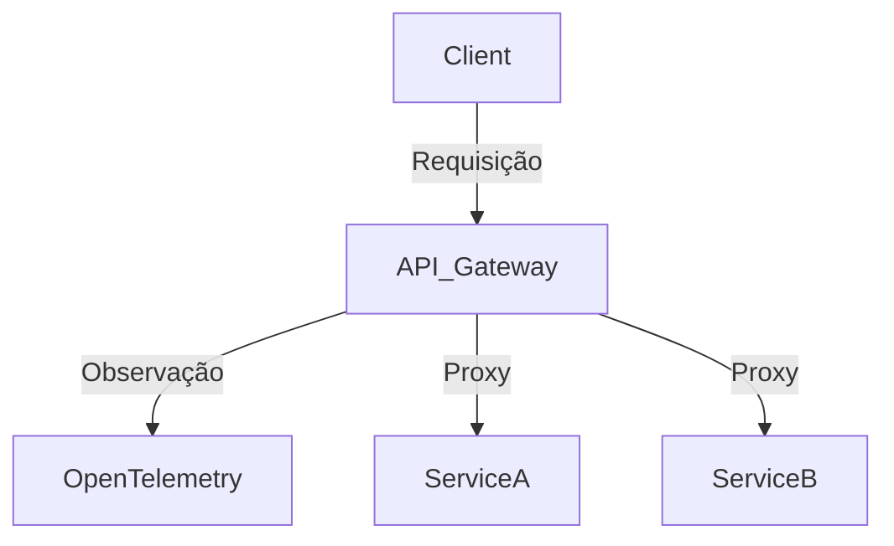
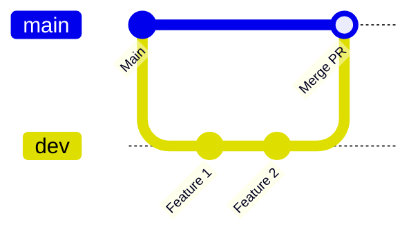

# 🚀 Fluxo de Estudo para um Desenvolvedor Sênior

> Um guia prático para se tornar um arquiteto de software completo, com foco em fundamentos, práticas modernas e projetos reais.

---

## 📚 Visão Geral do Fluxo

---

## 🧱 1. Fundamentos da Arquitetura de Software

* **Objetivo**: Compreender os tipos de arquitetura.
* 📌 *Imagem sugerida*: Comparativo entre arquitetura monolítica, em camadas, hexagonal e microsserviços.

---

## 🏗️ 2. Sistemas Monolíticos

* **Objetivo**: Entender limitações e acoplamentos.
* 📌 *Imagem sugerida*: Diagrama de um sistema com camadas (UI, Application, Infra, Domain).

---

## 🔗 3. Microsserviços

* **Objetivo**: Estratégia de transição e independência de contexto.
* 📌 *Imagem sugerida*: Diagrama de microsserviços interconectados com API Gateway.

---

## 🧼 4. SOLID e Clean Architecture

* **Objetivo**: Separação de responsabilidades e testabilidade.
* 📌 *Imagem sugerida*: Onion Model (Camadas de Clean Architecture).

---

## 📦 5. Domain Driven Design (DDD)

* **Objetivo**: Modelagem centrada no domínio.
* 📌 *Imagem sugerida*: Context Map + Bounded Contexts.

---

## ⚡ 6. Event Storming

* **Objetivo**: Descoberta de domínio colaborativa.
* 📌 *Imagem sugerida*: Fluxo de eventos, comandos, agregados.

---

## 🛡️ 7. Arquitetura Hexagonal (Ports & Adapters)

* **Objetivo**: Isolamento entre domínio e infraestrutura.
* 📌 *Imagem sugerida*: Diagrama de portas e adaptadores.

---

## 🔁 8. Comunicação entre Sistemas

* **Objetivo**: REST x gRPC x Mensageria.
* 📌 *Imagem sugerida*: Fluxo de chamadas síncronas e assíncronas.

---

## 📊 9. Event Driven Architecture (EDA)

* **Objetivo**: Desacoplamento e reatividade.
* 📌 *Imagem sugerida*: Event Bus, Producers, Consumers.

---

## ✉️ 10. Mensageria (RabbitMQ, Kafka)

* **Objetivo**: Padrões Publish/Subscribe, Eventual Consistency.
* 📌 *Imagem sugerida*: Brokers e fluxos de mensagens.

---

## 🔐 11. Autenticação e Autorização

* **Objetivo**: OAuth2, OpenID, Keycloak.
* 📌 *Imagem sugerida*: Fluxo de autenticação com Access Token e Refresh Token.

---

## ⚙️ 12. Contêineres e Infraestrutura como Código

### Docker

* Containerização e build pipelines.

### Kubernetes

* Orquestração, autoscaling e service mesh.

### Terraform e Ansible

* Provisionamento e automação de infraestrutura.

---

## 🔄 13. CI/CD e GitOps

* **Objetivo**: Automação de testes, build e deploy.
* 📌 *Imagem sugerida*: Pipeline CI/CD (Build → Test → Deploy → Monitoramento).

---

## 🧭 14. API Gateway e Observabilidade

### Kong API Gateway

* Roteamento, autenticação, rate limit.

### OpenTelemetry

* Tracing, métricas, logs.

---

## 🛠️ 15. Projetos Práticos

### Codeflix

* DDD, TDD, Clean Architecture.

### Microsserviço de Encoder em Go

* Kafka + REST + Docker + MongoDB.

---

## 🧑‍💻 16. Git e GitHub Avançado

* Branching Strategies (Git Flow, Trunk Based).
* Pull Requests, GitHub Actions.

---

## ✅ Conclusão

Esse roteiro oferece uma trilha progressiva para arquitetos de software em ascensão. A combinação de conceitos sólidos, práticas modernas e projetos práticos garantirá domínio técnico e visão sistêmica.

> ⚠️ **Dica**: Use ferramentas como [Draw.io](https://draw.io), [Whimsical](https://whimsical.com) ou [Mermaid.js](https://mermaid.js.org) para criar seus próprios diagramas ao estudar.

---

## 📬 Entre em Contato

Entre em contato para **colaborações, dúvidas ou consultorias**:

- ✉️ **Email Pessoal**: [daniloopro@gmail.com](mailto:daniloopro@gmail.com)  
- 🏢 **Email Empresarial (DevsFree)**: [devsfree@devsfree.com.br](mailto:devsfree@devsfree.com.br)  
- 📊 **Consultoria (dopme.io)**: [contato@dopme.io](mailto:contato@dopme.io)  
- 💼 **LinkedIn**: [Danilo O. Pinheiro](https://www.linkedin.com/in/daniloopinheiro)
